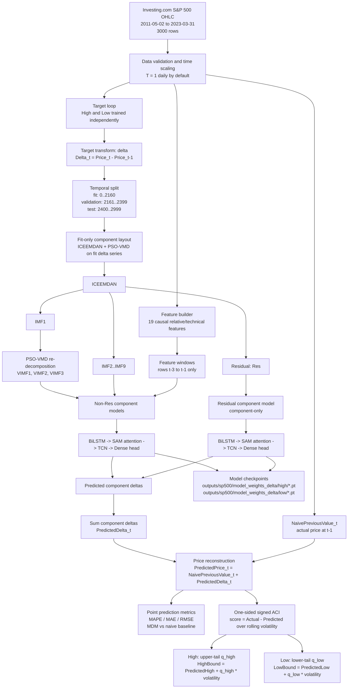

# Latest Program Architecture

This diagram reflects the current S&P 500 High/Low pipeline after the delta-target revision.



## Component Inputs

| Component type | Components | Input per timestep | Window size | Model |
|---|---|---:|---:|---|
| VMD / IMF components | `VIMF1..VIMF3`, `IMF2..IMF9` | 1 component value + 19 features = 20 | 3 | BiLSTM -> SAM -> TCN -> Dense |
| Residual component | `Res` | 1 residual value | 3 | BiLSTM -> SAM -> TCN -> Dense |

Each target currently uses 12 component models:

```text
VIMF1, VIMF2, VIMF3, IMF2, IMF3, IMF4, IMF5, IMF6, IMF7, IMF8, IMF9, Res
```

## No-Lookahead Policy

The current main config uses `decomposition.scope: walk_forward`.

For each validation/test day `t`:

```text
1. Re-decompose only historical delta values through t-1.
2. Build component windows from t-3, t-2, t-1.
3. Build feature windows from t-3, t-2, t-1.
4. Predict Delta_t.
5. Reconstruct price with the already-known Price_t-1.
6. ACI uses only past residual scores to build the bound for day t.
```

This avoids the full-sample decomposition leakage problem that appears when the complete 2011-2023 series is decomposed before the train/test split.

