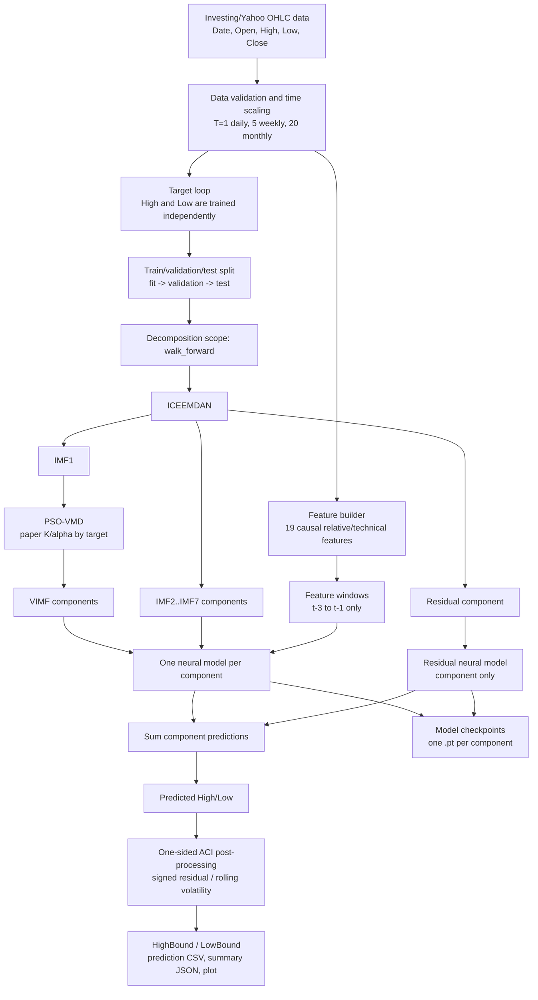
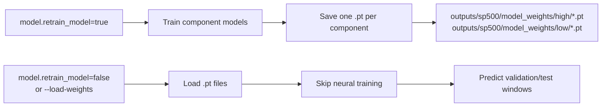

# S&P 500 Forecast Project Architecture

This document describes the current `/Users/francis/Desktop/ML_test` project state.

## Overall Pipeline



## Current Config Snapshot

| Area | Current setting |
|---|---|
| Targets | `High`, `Low` |
| Decomposition mode | `iceemdan_pso_vmd` |
| Decomposition scope | `walk_forward` |
| Neural variant | `proposed` |
| Window size | `3` days |
| Feature mode | enabled |
| Residual uses exogenous features | false |
| ACI target coverage | `0.95` |
| ACI volatility window | `252` |
| ACI calibration score window | `63` |
| Model checkpoint switch | `model.retrain_model` |
| Checkpoint directory | `outputs/sp500/model_weights/{target}/` |

## Feature Set

Current code builds **19 exogenous features** for this S&P 500 dataset. They are causal: prediction day `t` uses feature rows `t-3` through `t-1`, never row `t`.

| Group | Count | Features |
|---|---:|---|
| OHLC-relative | 7 | `CloseReturn`, `LogCloseReturn`, `HighPrevClosePct`, `LowPrevClosePct`, `HighLowRangePct`, `OpenPrevClosePct`, `CloseOpenChangePct` |
| Moving average / return std | 6 | `CloseSMA5Ratio`, `ReturnStd5`, `CloseSMA10Ratio`, `ReturnStd10`, `CloseSMA20Ratio`, `ReturnStd20` |
| Momentum / oscillator | 1 | `RSI14` |
| MACD family | 3 | `MACDPct`, `MACDSignalPct`, `MACDHistPct` |
| Volatility / band width | 2 | `RollingVolatility20`, `BollingerBandwidth20` |
| Total | 19 |  |

If a future input CSV contains `Volume`, the code can add `VolumeChangePct` and `LogVolumeChange`, raising the feature count to 21. The current S&P output uses 19.

## Component Models And Feature Counts

Each target is decomposed and then trained as a collection of component models. Current High output has 10 component models. Low uses the same component layout when rerun under the current code.

For non-residual components:

```text
per timestep input = 1 component value + 19 exogenous features = 20 features
window input shape = 3 days x 20 features
```

For the residual component:

```text
per timestep input = 1 residual component value + 0 exogenous features = 1 feature
window input shape = 3 days x 1 feature
```

| Target | Component model | Exogenous features | Component value | Features per timestep | Window shape |
|---|---|---:|---:|---:|---|
| High | `VIMF1` | 19 | 1 | 20 | `3 x 20` |
| High | `VIMF2` | 19 | 1 | 20 | `3 x 20` |
| High | `VIMF3` | 19 | 1 | 20 | `3 x 20` |
| High | `IMF2` | 19 | 1 | 20 | `3 x 20` |
| High | `IMF3` | 19 | 1 | 20 | `3 x 20` |
| High | `IMF4` | 19 | 1 | 20 | `3 x 20` |
| High | `IMF5` | 19 | 1 | 20 | `3 x 20` |
| High | `IMF6` | 19 | 1 | 20 | `3 x 20` |
| High | `IMF7` | 19 | 1 | 20 | `3 x 20` |
| High | `Res` | 0 | 1 | 1 | `3 x 1` |
| Low | `VIMF1` | 19 | 1 | 20 | `3 x 20` |
| Low | `VIMF2` | 19 | 1 | 20 | `3 x 20` |
| Low | `VIMF3` | 19 | 1 | 20 | `3 x 20` |
| Low | `IMF2` | 19 | 1 | 20 | `3 x 20` |
| Low | `IMF3` | 19 | 1 | 20 | `3 x 20` |
| Low | `IMF4` | 19 | 1 | 20 | `3 x 20` |
| Low | `IMF5` | 19 | 1 | 20 | `3 x 20` |
| Low | `IMF6` | 19 | 1 | 20 | `3 x 20` |
| Low | `IMF7` | 19 | 1 | 20 | `3 x 20` |
| Low | `Res` | 0 | 1 | 1 | `3 x 1` |

## Neural Model Variants

The same component input design is used across variants; the difference is the neural block.

| `model.variant` | Architecture |
|---|---|
| `proposed` | BiLSTM -> SAM attention -> TCN -> dense head |
| `no_attention` | BiLSTM -> TCN -> dense head |
| `no_tcn` | BiLSTM -> SAM attention -> dense head |
| `no_bilstm` | Linear projection -> SAM attention -> TCN -> dense head |
| `lstm_sam_tcn` | LSTM -> SAM attention -> TCN -> dense head |
| `bilstm_sam_cnn` | BiLSTM -> SAM attention -> 1D CNN -> dense head |

## Decomposition / Ablation Modes

| `decomposition.mode` | Component layout |
|---|---|
| `iceemdan_pso_vmd` | `IMF1` is re-decomposed into `VIMF1..VIMFK`; then `IMF2..IMFn`; then `Res` |
| `iceemdan` | `IMF1..IMFn`; then `Res` |
| `none` | one component: `Original` |

With the current paper VMD parameters for S&P 500, `K=3`, so the current component layout is:

```text
VIMF1, VIMF2, VIMF3, IMF2, IMF3, IMF4, IMF5, IMF6, IMF7, Res
```

## Checkpoint Flow



Each checkpoint contains:

- PyTorch `state_dict`
- target `MinMaxScaler1D`
- optional feature `StandardScaler2D`
- model architecture metadata
- selected training params
- validation loss / epochs run

## ACI Boundary Layer

The ACI layer runs after point prediction. It does not change `Predicted`; it adds target-specific one-sided calibrated bounds.

```text
r_t = (Actual_t - Predicted_t) / Volatility_t

High:
q_high,t = recent upper-tail quantile of r_t
HighBound_t = PredictedHigh_t + q_high,t * Volatility_t
ErrHigh_t = 1{ActualHigh_t > HighBound_t}

Low:
q_low,t = recent lower-tail quantile of r_t
LowBound_t = PredictedLow_t + q_low,t * Volatility_t
ErrLow_t = 1{ActualLow_t < LowBound_t}
```

The exported prediction CSV also includes a band-specific diagnostic:

```text
BoundBandCovered_t = 1{Actual_t is between Predicted_t and HighBound_t / LowBound_t}
bound_band_coverage = mean(BoundBandCovered_t)
```

This is separate from ACI one-sided coverage. For example, High ACI coverage only checks `ActualHigh_t <= HighBound_t`; band coverage additionally requires Actual to sit inside the shaded band between `Predicted` and `HighBound`.

Current ACI settings:

| Setting | Value |
|---|---:|
| one-sided target coverage | `0.95` |
| volatility window | `252` |
| calibration score window | `63` |
| gamma | `0.005` |

## Note On Existing Low Output

The current source code uses `RollingVolatility20`, not ATR. If `outputs/sp500/summary_low.json` still shows `ATRPct`, that file was generated before the feature rename and should be rerun.
